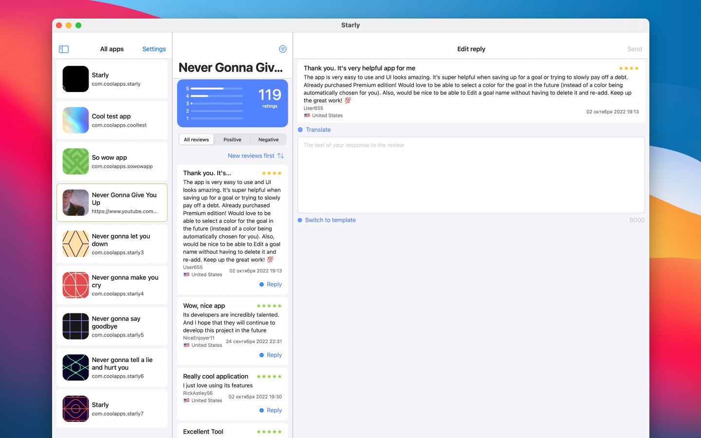

## What's Starly?

The Starly app is a project that will allow developers to manage reviews on the App Store with ease. You can reply to them, translate them to the language you want, filter them, and create templates.

Among the main features:
- Translation of reviews. You will be able to translate a user's review as well as your text into their language.
- The ability to filter positive and negative reviews.
- Creation of templates. For any type of reviews, for any of your applications, in any quantity.
- Universal application for iOS, iPad OS and Mac OS. One solution for everything.
- Customize reviews and share them on social networks. Use backgrounds, fonts, customizable blocks.
- Quick performance. Work with the App Store Connect API to get the reviews you need for each app in a blazing fast way.
- Edit! Edit reviews in real time, delete your responses and manage them with ease.

This and more in Starly will let you use your Apple Developer Program to its fullest potential. Edit, manage, and respond to your users.

At any time with Starly.

[Download](https://appstoreconnect.apple.com/apps/1644699015)

**Support or Contact**

Having trouble? Please, ask us by [mail](mailto:viktorianecc@gmail.com) and we’ll help you.
